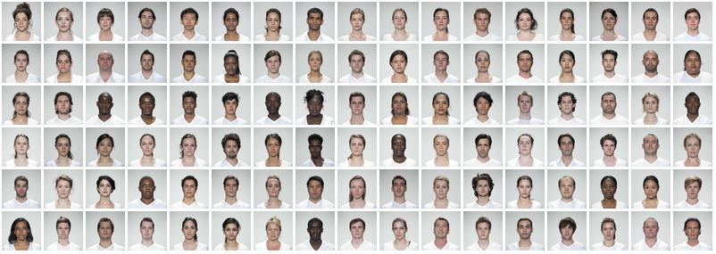
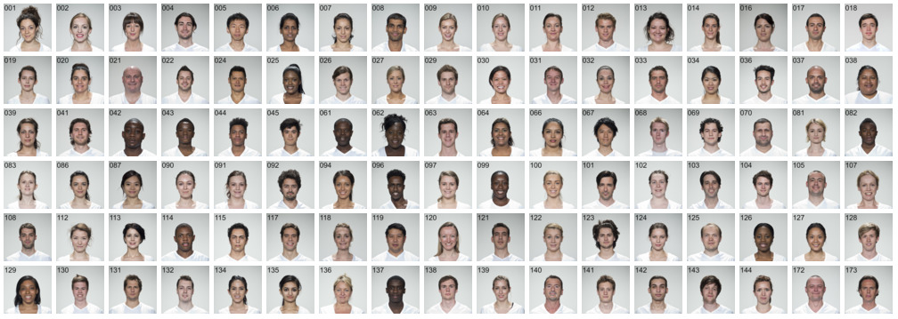
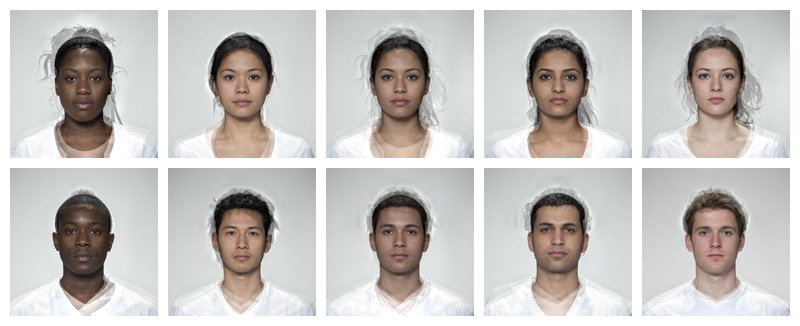
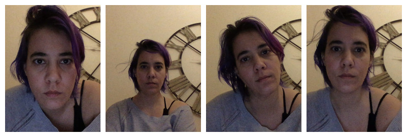
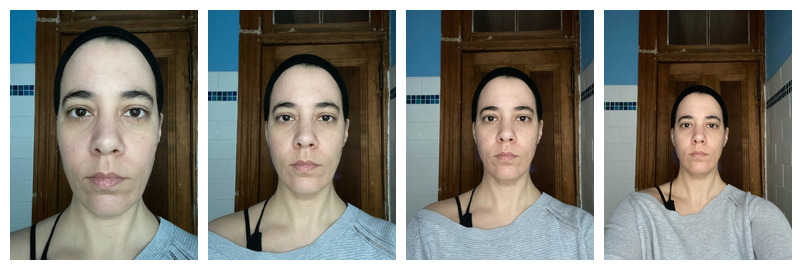
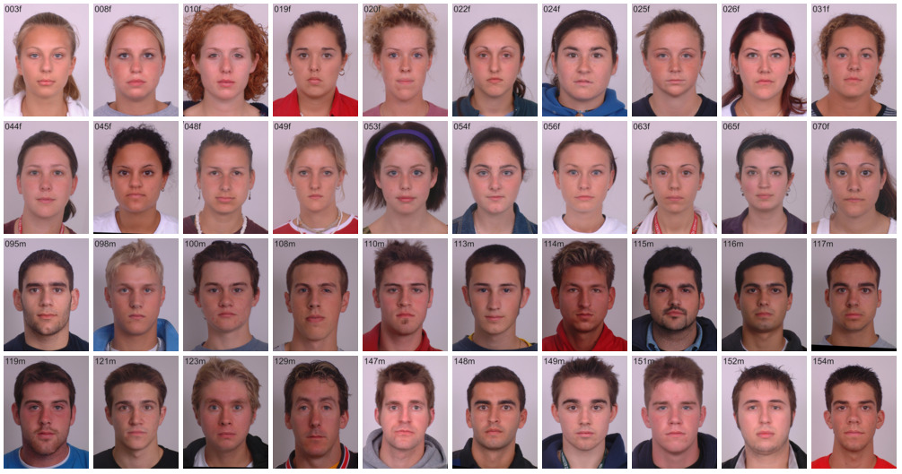

# stimsets

<!-- badges: start -->
<!-- badges: end -->

<style>
cite {
  display: inline-block;
  font-style: normal;
  padding: 0.5em 1em;
  margin: 1em 0;
  border: 2px solid #204868;
  border-radius: 1em;
}
</style>

Demo stimulus sets for use with [webmorphR](https://debruine.github.io/webmorphR).

## Installation

You can install the development version of webmorphR.stim from GitHub with:

``` r
remotes::install_github("debruine/webmorphR.stim")
```

Please cite the individual stimulus sets if you use them in publications:

### london

Images are of 102 adult faces 1350x1350 pixels in full colour. Template files mark out 189 coordinates delineating face shape, for use with Psychomorph or WebMorph.org.

Self-reported age, gender and ethnicity are included in `london_info()`.

All individuals gave signed consent for their images to be "used in lab-based and web-based studies in their original or altered forms and to illustrate research (e.g., in scientific journals, news media or presentations)." Images were taken in London, UK, in April 2012.
    
<cite>CC-BY: DeBruine, L., & Jones, B. (2017). Face Research Lab London Set (Version 5). figshare. <https://doi.org/10.6084/m9.figshare.5047666.v5></cite>



### smiling

Smiling versions of the 102 individuals in the London set.
    
<cite>CC-BY: DeBruine, L., & Jones, B.. (2017). Face Research Lab London Set (Version 5). figshare. <https://doi.org/10.6084/m9.figshare.5047666.v5></cite>




### composite

This image set comprises 5 male and 5 female composite images (4 individuals per composite) of adult individuals of African, East Asian, West Asian and White ethnic backgrounds from the London set above, plus a composite image of all 4 ethnic groupings. Images are 1350x1350 pixels in full colour.

<cite>CC-BY: DeBruine, Lisa (2016): Young adult composite faces. figshare. <https://doi.org/10.6084/m9.figshare.4055130.v1></cite>



### lisa

Four images of the same person with varying face size, position and rotation.



### zoom

Four images of the same person with varying head-to-camera distance (only very approximately 15, 30, 45 and 60 cm).



## canada

This image set contains images of 20 male and 20 female young adult White students from a university in Ontario, Canada. The images have been aligned on pupils and delineated using WebMorph.org. All images are JPGs at 1350x1800 pixels.

<cite>CC-BY: DeBruine, L., & Jones, B.. (2017).Young Adult White Faces with Manipulated Versions (Version1). figshare. <https://doi.org/10.6084/m9.figshare.4220517.v1></cite>



